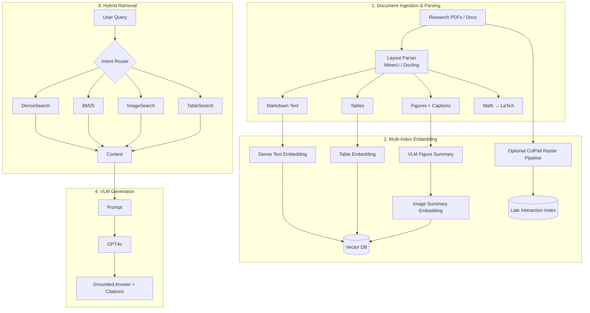
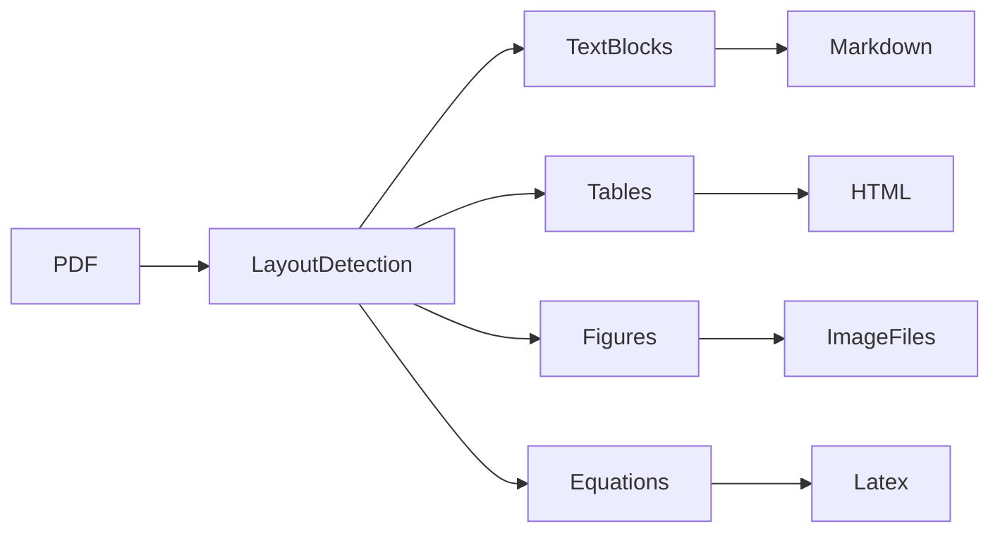
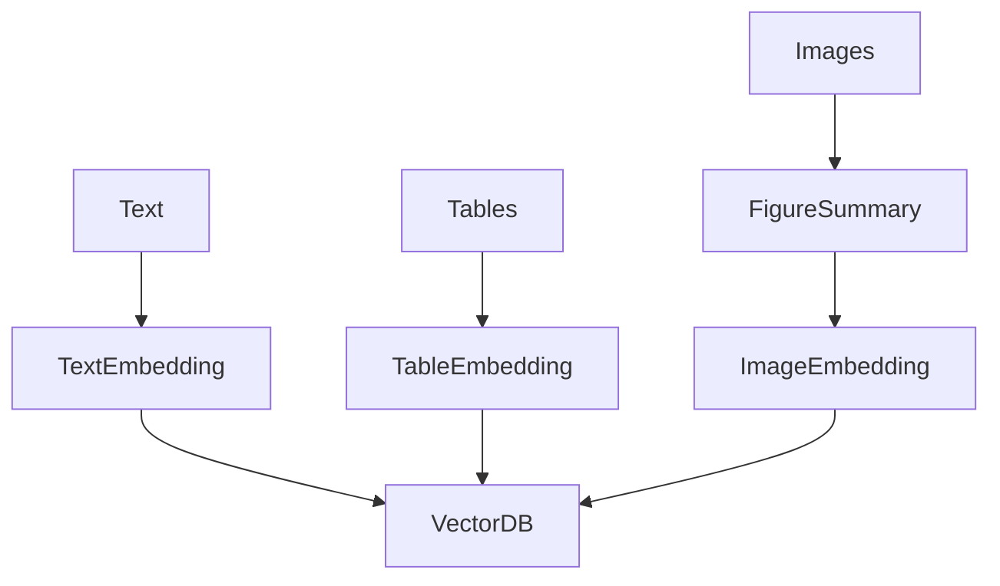
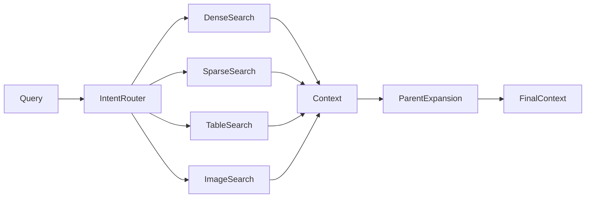

# Comprehensive Architecture & Implementation Guide: Multimodal Research RAG System

> **Version:** 1.0  
> **Purpose:** Production-grade implementation blueprint for a **Multimodal Retrieval-Augmented Generation (RAG)** system optimized for scientific literature, academic publications, engineering documentation, whitepapers, patents, and technical reports.

---

# Table of Contents

1. [System Architecture & Overview](#1-system-architecture--overview)
2. [Component 1: Document Ingestion & Advanced Parsing](#2-component-1-document-ingestion--advanced-parsing)
3. [Component 2: Multi-Index Embedding & Vector Storage](#3-component-2-multi-index-embedding--vector-storage)
4. [Component 3: Hybrid Retrieval & Intelligent Query Routing](#4-component-3-hybrid-retrieval--intelligent-query-routing)
5. [Component 4: Interleaved Multimodal Generation & Citation Engine](#5-component-4-interleaved-multimodal-generation--citation-engine)
6. [Technology Stack Matrix](#6-technology-stack-matrix)
7. [Non-Functional Requirements & Edge Case Engineering](#7-non-functional-requirements--edge-case-engineering)

---

# 1. System Architecture & Overview

Traditional text-only Retrieval-Augmented Generation (RAG) pipelines perform poorly on scientific and technical documents because they assume knowledge exists exclusively as linear text. Modern research papers instead encode information across multiple modalities:

- Multi-column layouts
- Mathematical equations
- Scientific tables
- Experimental plots
- Flow diagrams
- Architecture figures
- Chemical structures
- Images with detailed captions

Simply extracting raw text loses critical structural relationships, resulting in incomplete retrieval and hallucinated answers.

The proposed architecture implements a **Hybrid Multimodal Retrieval Strategy** where each document modality is independently parsed, indexed, retrieved, and later recombined during generation.

---

## High-Level Pipeline



---

## Design Goals

The architecture emphasizes:

- High retrieval precision
- Layout preservation
- Mathematical fidelity
- Figure-aware reasoning
- Table-aware search
- Low hallucination rate
- Explainable citations
- Production scalability

---

# 2. Component 1: Document Ingestion & Advanced Parsing

## Purpose

The ingestion layer transforms complex PDFs into structured multimodal knowledge objects while preserving semantic relationships between text, equations, tables, and images.

---

## Why Traditional PDF Parsing Fails

Conventional parsers such as:

- PyPDF2
- pdfplumber
- PDFMiner

typically suffer from:

- Mixed reading order
- Broken multi-column layouts
- Missing figure references
- Destroyed tables
- Lost equations
- No image-text linkage

These failures propagate downstream into poor retrieval quality.

---

## Recommended Parsing Engines

| Tool | Strength |
|-------|----------|
| MinerU | Excellent layout detection and OCR |
| Docling | Structured parsing with hierarchy preservation |
| Marker | Markdown-oriented parsing |
| LlamaParse | Cloud-native intelligent parsing |

---

## Parsing Workflow



---

## Text Extraction

The parser should preserve document hierarchy.

Example:

```text
Section 4

    4.1

        Paragraph

    4.2

        Paragraph

            Bullet

                Sub Bullet
```

Output:

```markdown
# Section 4

## 4.1

Paragraph...

## 4.2

Paragraph...

- Item

    - Sub Item
```

Hierarchy preservation greatly improves retrieval context.

---

## Equation Extraction

Equations should **never** be converted into plain text.

Correct:

```latex
\mathbf{A}x=b
```

Instead of:

```
A x = b
```

Supported mathematical structures include:

- Matrices
- Integrals
- Fractions
- Greek symbols
- Tensor notation
- Superscripts
- Subscripts

---

## Table Extraction

Tables require specialized structure recognition.

Example output:

| Epoch | Accuracy |
|--------|----------|
| 5 | 89.2 |
| 10 | 91.5 |
| 20 | 93.1 |

Preferred formats:

- Markdown
- HTML

Never flatten tables into whitespace-separated text.

---

## Figure Extraction

Every detected figure becomes an independent asset.

Metadata example:

```json
{
  "figure_id":"fig_004",
  "caption":"Training loss comparison",
  "page":12,
  "bbox":[120,210,520,610],
  "image":"fig_004.png"
}
```

Each figure should retain:

- Caption
- Page number
- Bounding box
- Section
- Image path

---

## Output Objects

The ingestion layer produces:

```
Document

├── Markdown
├── Sections
├── Tables
├── Figures
├── Captions
├── Equations
└── Metadata
```

---

# 3. Component 2: Multi-Index Embedding & Vector Storage

## Philosophy

A single embedding index cannot accurately represent multiple document modalities.

Instead, maintain independent indexes optimized for each information type.

---

## Architecture



---

## Text Index

Stores:

- Paragraphs
- Sections
- Lists
- Mathematical explanations

Recommended embedding models:

- BGE-M3
- OpenAI text-embedding-3-large
- Voyage AI
- Cohere Embed

Metadata:

```json
{
 "section":"4.1",
 "page":8,
 "chunk":12,
 "parent":"Section 4"
}
```

---

## Sparse Keyword Index

Alongside dense vectors, maintain BM25 for exact lexical matching.

Essential for:

- Chemical formulas
- Gene identifiers
- Variable names
- Equation symbols
- Dataset names

Example:

```
BERT
ResNet50
NaCl
H₂SO₄
β
μ
```

---

## Table Index

Tables become searchable entities.

Pipeline:

```
Table

↓

Markdown

↓

Embedding

↓

Vector DB
```

Metadata includes:

- Page
- Caption
- Rows
- Columns

---

## Figure Summary Index

Images are summarized using a Vision-Language Model.

Example generated summary:

> "Line graph comparing Transformer and proposed architecture across 50 epochs showing faster convergence."

The summary—not the raw image—is embedded.

Metadata links back to:

```
figure.png
```

---

## Optional Late Interaction Index

For layout-heavy documents:

```
PDF Page

↓

Raster Image

↓

ColPali

↓

Patch Embeddings

↓

Multi-vector Index
```

Advantages:

- No OCR dependency
- Better chart retrieval
- Better complex layouts
- Better diagrams

---

## Vector Database

Recommended:

- Qdrant
- Milvus
- Weaviate
- PGVector

Required capabilities:

- Dense search
- Sparse search
- Metadata filters
- Payload indexing
- Hybrid ranking

---

# 4. Component 3: Hybrid Retrieval & Intelligent Query Routing

## Overview

Retrieval combines semantic search, keyword search, visual search, and contextual expansion.

---

## Retrieval Pipeline



---

## Query Intent Router

The router classifies queries into categories.

Examples:

### Conceptual Query

```
Explain the optimization strategy.
```

Search:

- Dense vectors
- BM25

---

### Table Query

```
Compare latency values.
```

Search:

- Tables
- Text

---

### Figure Query

```
Explain Figure 7.
```

Search:

- Image summaries
- Caption
- Nearby text

---

### Mathematical Query

```
Derive Equation 12.
```

Search:

- LaTeX
- Parent section
- Explanation paragraphs

---

## Parent-Child Expansion

Retrieved chunks often lack sufficient context.

Example:

```
Chunk:

"The proposed model achieved 92%."

Expanded:

Section 4

Paragraph

Experiment

Discussion
```

This significantly improves generation quality.

---

## Context Assembly

Final prompt includes:

```
Top K text

+

Top M tables

+

Top N figures

+

Metadata

+

User query
```

Recommended defaults:

```
Text : 5

Tables : 2

Figures : 2
```

---

# 5. Component 4: Interleaved Multimodal Generation & Citation Engine

## Objective

The generation layer synthesizes responses from multiple modalities while preserving evidence attribution.

---

## Supported Models

Production-ready options:

- Claude 3.5 Sonnet
- GPT-4o
- Qwen2-VL-72B
- Llama-3.2 Vision

---

## Prompt Construction

Interleaved prompts maintain modality ordering.

Example:

```
[Retrieved Text]

...

[Retrieved Table]

...

[Retrieved Figure]

...

[User Question]
```

This enables the model to reason jointly across textual and visual evidence.

---

## Citation Rules

Every factual statement must reference its source.

Examples:

```
[Source: Section 4.2]

[Source: Table 3]

[Source: Figure 5]

[Source: Page 18]
```

No unsupported claims should be generated.

---

## Figure Reasoning

When figures are retrieved, the model should:

1. Read caption
2. Inspect image
3. Compare with nearby text
4. Verify numerical consistency
5. Generate grounded explanation

---

## Final Output Format

```
Answer

↓

Supporting Evidence

↓

Figures Used

↓

Tables Used

↓

Citations
```

---

# 6. Technology Stack Matrix

| Layer | Recommended | Alternatives | Role |
|--------|-------------|-------------|------|
| Parsing | MinerU | Docling, Marker, LlamaParse | Layout-aware parsing |
| OCR | MinerU OCR | PaddleOCR | Image text extraction |
| Embedding | BGE-M3 | OpenAI, Voyage, Cohere | Semantic embeddings |
| Sparse Retrieval | BM25 | Elasticsearch | Exact keyword search |
| Vector DB | Qdrant | Milvus, Weaviate, PGVector | Hybrid retrieval |
| Orchestration | LlamaIndex | LangChain, Haystack | Pipeline management |
| Figure Captioning | GPT-4o | Qwen2-VL | Visual summarization |
| Generation | Claude 3.5 Sonnet | GPT-4o, Qwen2-VL | Multimodal reasoning |
| Storage | S3 / MinIO | Azure Blob, GCS | Figures and assets |
| Cache | Redis | Memcached | Embedding and retrieval cache |

---

## Suggested Production Stack

```
MinerU

↓

LlamaIndex

↓

BGE-M3

↓

Qdrant

↓

GPT-4o

↓

FastAPI

↓

Redis

↓

S3
```

---

# 7. Non-Functional Requirements & Edge Case Engineering

## Token Management

Research papers may contain:

- 30+ figures
- 200-page PDFs
- Large tables
- High-resolution images

Only inject:

- Top 5 text chunks
- Top 2 figures
- Top 2 tables

Avoid unnecessary context expansion.

---

## Mathematical Fidelity

All mathematical expressions must remain inside LaTeX containers.

Correct:

```latex
\sum_{i=1}^{n}x_i
```

Never degrade into plain text.

---

## Visual Hallucination Prevention

Implement cross-verification:

```
Retrieved Figure

↓

Retrieved Table

↓

Compare Values

↓

Generate Answer
```

If discrepancies exist:

- Mention uncertainty
- Prefer structured table values
- Cite both sources

---

## Metadata Integrity

Each indexed object should retain:

- Document ID
- Section
- Page
- Bounding box
- Caption
- Parent section
- Chunk ID
- File path

---

## Scalability

Recommended deployment:

```
Parser Workers

↓

Embedding Queue

↓

Vector DB

↓

Retrieval Service

↓

Generation Service

↓

API Gateway
```

Asynchronous processing enables horizontal scaling across large document collections.

---

## Reliability Best Practices

- Retry failed parsing jobs.
- Deduplicate document embeddings using content hashes.
- Cache frequently accessed embeddings and retrieval results.
- Monitor vector database latency and indexing throughput.
- Validate parser outputs before ingestion.
- Log retrieval scores and citation sources for observability.
- Implement access controls for sensitive research documents.

---

# Conclusion

This architecture delivers a production-ready **Multimodal Research RAG** system capable of understanding and retrieving information across text, tables, equations, and figures while maintaining high retrieval precision and grounded multimodal reasoning.

By combining **layout-aware parsing**, **multi-index retrieval**, **hybrid dense/sparse search**, **vision-language understanding**, and **strict citation enforcement**, the system overcomes the limitations of conventional text-only RAG pipelines and provides reliable, explainable answers for complex scientific and technical documents.
